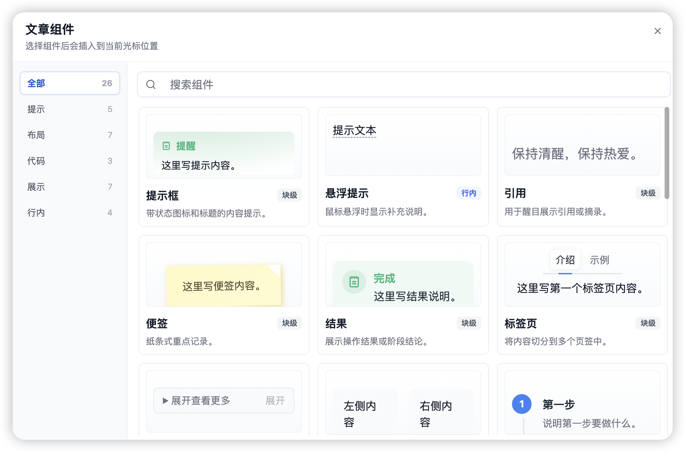
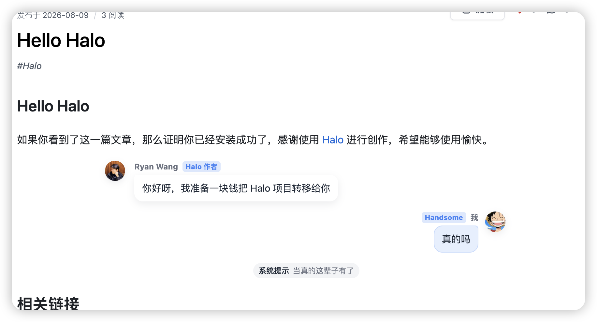

# Halo 文章组件插件

为 Halo 文章提供一组可在编辑器中快速插入、前台自动渲染的内容增强组件。插件内置提示框、标签页、折叠面板、聊天气泡、时间线、步骤、复制命令、图片、进度条等常用内容块，让文章排版和交互展示更丰富。

## 🌐 演示与交流

- **演示站点1**：[https://www.xhhao.com/](https://www.xhhao.com/)
- **文档**：[https://docs.lik.cc/](https://docs.lik.cc/)
- **QQ 交流群**：[](https://www.xhhao.com/upload/iShot_2025-03-03_16.03.00.png)

## 预览





## 内置组件

当前包含以下组件：

- 提示：提示框、悬浮提示、引用、便签、结果
- 布局：标签页、折叠面板、分栏、步骤、时间线、卡片列表、对比
- 代码：复制命令、命令组、快捷键
- 展示：聊天、图片、PDF 预览、哔哩哔哩视频、进度条、状态、徽标、按钮、任务清单
- 行内：表情时钟、模糊文本、批注、阅读时间

## 作为标签使用

如果你使用默认编辑器，通常只需要在编辑器中插入和配置组件。除此之外，也可以直接在文章 HTML 中使用 `xhhao-com-*` 标签。

### xhhao-com-alert

提示框，适合展示提醒、信息、问题、警告、错误等内容。

```html
<xhhao-com-alert type="warning" title="注意">
  这里写警告内容。
</xhhao-com-alert>
```

参数：

- `type`：状态，可选值为 `tip`、`info`、`question`、`warning`、`error`。
- `title`：标题。
- `icon`：自定义图标，支持 SVG 字符串或图片 URL。

### xhhao-com-tab

标签页，用于把内容切分到多个页签中。

```html
<xhhao-com-tab tabs="介绍,示例" active="1">
  <xhhao-com-tab-panel>第一个标签页内容。</xhhao-com-tab-panel>
  <xhhao-com-tab-panel>第二个标签页内容。</xhhao-com-tab-panel>
</xhhao-com-tab>
```

参数：

- `tabs`：标签名称，使用英文逗号分隔。
- `active`：默认激活的标签序号，从 `1` 开始。
- `center`：是否居中显示标签。

### xhhao-com-copy

复制命令，用于展示可一键复制的代码或命令。

```html
<xhhao-com-copy prompt="$">
  pnpm install
</xhhao-com-copy>
```

参数：

- `prompt`：命令提示符，例如 `$`、`>`。

### xhhao-com-chat

聊天气泡，用于展示对话内容，支持头像、徽标、自己消息和系统消息。

```html
<xhhao-com-chat>
  <xhhao-com-chat-item
    name="Ryan Wang"
    avatar="https://example.com/avatar-a.png"
    badge="Halo 作者"
  >
    你好呀，我准备一块钱把 Halo 项目转移给你
  </xhhao-com-chat-item>
  <xhhao-com-chat-item
    name="Handsome"
    avatar="https://example.com/avatar-b.png"
    badge="我"
    self
  >
    真的吗
  </xhhao-com-chat-item>
  <xhhao-com-chat-item name="系统提示" system>
    当真的这辈子有了
  </xhhao-com-chat-item>
</xhhao-com-chat>
```

参数：

- `name`：昵称。
- `avatar`：头像 URL。
- `badge`：昵称旁的徽标。
- `self`：是否显示为自己的消息。
- `system`：是否显示为系统消息。

### xhhao-com-progress

进度条，用于展示百分比或任务进度。

```html
<xhhao-com-progress label="迁移进度" value="80" max="100" color="#3b82f6"></xhhao-com-progress>
```

参数：

- `label`：进度标题。
- `value`：当前值。
- `max`：最大值，默认 `100`。
- `color`：自定义颜色。

### xhhao-com-pdf

PDF 预览，用于在文章中嵌入并预览 PDF 文件，支持从 Halo 附件库中选择。

```html
<xhhao-com-pdf src="https://example.com/document.pdf" title="PDF 文档" width="100%" height="500px"></xhhao-com-pdf>
```

参数：

- `src`：PDF 文件地址，支持从 Halo 附件库中选择。
- `title`：标题。
- `width`：宽度，默认 `100%`。
- `height`：高度，默认 `500px`。

### xhhao-com-bilibili

哔哩哔哩视频，用于在文章中嵌入 B 站视频播放器。

```html
<xhhao-com-bilibili bvid="BV1xx411c7mD" title="视频标题" page="1"></xhhao-com-bilibili>
```

参数：

- `bvid`：视频 BV 号，与 `aid` 二选一。
- `aid`：视频 AV 号（纯数字，不含 `av` 前缀也可以）。
- `title`：标题。
- `page`：分 P 序号，默认 `1`。
- `autoplay`：是否自动播放。
- `width`：宽度，默认 `100%`。
- `height`：高度，默认按 `16:9` 比例自适应。

## 前台资源

插件启用后会自动向前台页面注入独立资源：

```html
<script src="/plugins/content-widgets/assets/static/content-widgets.iife.js"></script>
<link rel="stylesheet" href="/plugins/content-widgets/assets/static/content-widgets.css" />
```

资源由插件自身构建和提供，不需要主题主动引入。

## PJAX 兼容

插件本身不会实现 PJAX。前台脚本会在首次加载时自动挂载组件，并暴露：

```js
window.XhhaoComContentWidgets?.mount(document)
```

如果主题使用 PJAX / Swup，只需要在页面替换完成后调用一次 `mount` 即可。重复调用不会重复挂载已经处理过的组件。

## 主题适配

插件样式内置了一组 `--xhhao-com-*` CSS 变量，并对常见主题变量提供 fallback。一般情况下无需主题额外适配。

常用变量：

| 变量名 | 描述 |
| --- | --- |
| `--xhhao-com-text-1` | 主要文字颜色 |
| `--xhhao-com-text-2` | 次要文字颜色 |
| `--xhhao-com-bg` | 页面背景颜色 |
| `--xhhao-com-bg-card` | 卡片背景颜色 |
| `--xhhao-com-bg-2` | 次级背景颜色 |
| `--xhhao-com-border` | 边框颜色 |
| `--xhhao-com-primary` | 主色 |
| `--xhhao-com-shadow` | 阴影颜色 |

<details>
<summary>点击查看 CSS 变量模板</summary>

```css
:root {
  --xhhao-com-text-1: #111827;
  --xhhao-com-text-2: #6b7280;
  --xhhao-com-bg: #ffffff;
  --xhhao-com-bg-card: #ffffff;
  --xhhao-com-bg-2: #f8fafc;
  --xhhao-com-border: #e5e7eb;
  --xhhao-com-primary: #3b82f6;
  --xhhao-com-shadow: rgb(15 23 42 / 0.08);
}
```

</details>

## 从主题移除重复加载

如果你是从主题内置内容组件迁移到插件，需要移除主题侧的旧入口，避免重复加载：

- 移除主题主样式中对内容组件样式目录的引入。
- 移除主题前端入口里对旧内容组件挂载逻辑的自动执行。
- 保留主题自己的其它前台能力，例如相册、天气、PJAX 等。

如果文章里仍有旧标签，需要将 `c-*` 批量改为 `xhhao-com-*`，例如 `c-alert` 改为 `xhhao-com-alert`。

## 开发构建

请在项目根目录执行：

```bash
source "$HOME/.nvm/nvm.sh"
nvm use 22
pnpm install
pnpm build
sh gradlew build
```

## 许可证

[GPL-3.0](./LICENSE) © Handsome
